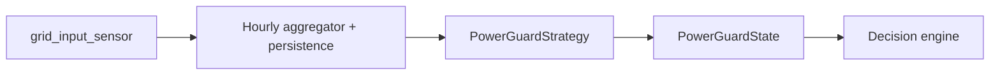

# Design Specification: Home Assistant `energy_dispatcher` Integration

## 1. Purpose

Build a Home Assistant custom integration that acts as an **energy decision engine** for controllable loads.

The integration answers:

> "Is this a suitable time to consume energy for this load, and which energy source is most appropriate?"

Its output is consumed by ordinary Home Assistant automations that control the physical device.

Example:

Integration output:

```
energy_dispatcher.dehumidifier

state: ON

energy_mode: SOLAR
```

Automation:

```
If energy_mode = SOLAR:
    set dehumidifier target humidity to 50 %

If energy_mode = GRID_CHEAP:
    set target humidity to 65 %
```

The integration's responsibility ends at the energy decision. Device behaviour is handled elsewhere.

---

## 2. Design Principles

### Separation of Concerns

**Energy Dispatcher is responsible for:**

* Spot price evaluation
* Grid import/export state
* Export economics (self-consumption vs selling)
* Power guard (optional)
* Economic rules
* Energy source selection
* Run/do-not-run recommendation

**Automations are responsible for:**

* Device function
* Setpoints
* Power levels
* Operating modes
* Physical control

Example:

Integration says:

```
Run dehumidifier using energy source SOLAR
```

Automation says:

```
SOLAR      → RH 50 %
GRID_CHEAP → RH 65 %
```

### Independent Load Decisions

Each `energy_dispatcher.*` entity makes a **local decision** based on grid import/export and price data.

The integration does **not** perform global capacity allocation or load prioritization between multiple loads. If two loads both recommend `ON` / `SOLAR` while surplus only covers one of them, that conflict is resolved outside this integration (automations, device limits, or user configuration).

### Testability

Decision logic must be isolated from Home Assistant:

```
models.py           # dataclasses: GlobalState, LoadConfig, Decision, PriceSlot, PowerGuardState
decision_engine.py  # pure logic, no HA imports
price_provider.py   # normalizes sensor data → PriceSlot timeline
power_guard.py      # aggregates import power + strategy evaluation (HA-free core)
coordinator.py      # reads sensors, calls engine
entity.py           # maps Decision → HA state and attributes
```

The decision engine must be fully unit-testable without running Home Assistant.

---

## 3. Domain

Domain name:

```
energy_dispatcher
```

Examples:

```
energy_dispatcher.water_heater
energy_dispatcher.dehumidifier
energy_dispatcher.ev_charger
```

Each entity represents a controllable energy consumer whose run decision can be optimized.

Repository name (`ha-energy-dispatcher`) and integration name (`energy_dispatcher`) are aligned.

---

## 4. Entity State

Each entity has a single primary state:

| State | Meaning |
|---|---|
| **ON** | The load is recommended to consume energy now |
| **OFF** | The load is not recommended to consume energy now |

Nuanced conditions (power guard warning, upcoming cheap window, blocked by price) are expressed through **attributes**, not additional states.

`WAITING` and `LIMITED` are intentionally omitted. Automations should use `energy_mode`, `reason`, and `grid_state` attributes rather than inferring behaviour from extra states.

---

## 5. Entity Attributes

Example:

```yaml
energy_dispatcher.dehumidifier:

  state: ON

  attributes:
    energy_mode: SOLAR
    reason: grid_export
    reason_text: "Grid export available — prefer self-consumption"

    available_power: 3200      # W, current grid output (export to grid)
    required_power: 1400       # W, configured load requirement

    price_state: LOW           # derived from current hour price
    grid_state: NORMAL         # NORMAL | WARNING | CRITICAL (from PowerGuardState)

    next_opportunity: null     # ISO datetime; set when OFF but a future window exists
```

Global diagnostic attributes (exposed on each entity or a future hub entity) may include power guard details when enabled:

```yaml
power_guard_strategy: ellevio
power_guard_peak_average: 8.4    # kW, calculated peak average for billing period
power_guard_headroom: 1.6        # kW, margin before load would affect peak ranking
power_guard_billing_period: "2026-07"
```

When `state` is `OFF` but a future allowed window exists:

```yaml
state: OFF
energy_mode: GRID_CHEAP
reason: not_cheap_yet
reason_text: "Current price above cheap threshold"
next_opportunity: "2026-07-15T02:00:00+02:00"
```

---

## 6. Energy Sources

The integration selects among these energy modes:

```
SOLAR
GRID_FREE
GRID_CHEAP
GRID_NORMAL
GRID_EXPENSIVE
BLOCKED
```

| Mode | When |
|---|---|
| **SOLAR** | Grid output covers the load; self-consumption is more attractive than export |
| **GRID_FREE** | Grid price at or below the configured free threshold |
| **GRID_CHEAP** | Grid price below the configured cheap threshold |
| **GRID_NORMAL** | Grid price within normal range |
| **GRID_EXPENSIVE** | Grid price above the expensive threshold; load rules disallow or defer |
| **BLOCKED** | Hard stop (power guard critical, override, or no allowed source) |

---

## 7. Global Configuration

Configured via Config Flow. One config entry holds global settings; individual loads are added through an Options Flow.

### 7.1 Architecture

```
Config Entry (global)
├── price sensor
├── grid input sensor (W)
├── grid output sensor (W)
├── export price source
├── power guard strategy + settings
├── price thresholds
└── Options Flow: "Add load" (repeatable)
    └── per load: name, required power, allowed sources, rules
```

A **DataUpdateCoordinator** maintains shared global state (price timeline, grid input/output, power guard state) and triggers per-entity recalculation when inputs change.

### 7.2 Spot Price

**Source:** any sensor providing current and upcoming spot prices.

The integration must not hard-code a specific price integration. Examples in documentation: Nord Pool, Tibber, Amber, Octopus Agile, etc.

Configuration:

* price sensor entity
* currency / unit (from sensor or user override)
* threshold rules (absolute and/or relative to rolling average)

Price levels (user-configurable):

| Level | Example rule |
|---|---|
| Free grid | spot price ≤ 2 (currency unit)/kWh |
| Cheap grid | spot price < 30 % of rolling weekly average |
| Expensive grid | spot price > 150 % of rolling weekly average |

The decision engine evaluates **all available price data** from the sensor — typically today's and tomorrow's hourly prices once published (day-ahead markets usually publish next-day prices around midday).

A **PriceProvider** adapter normalizes sensor state and attributes into a uniform timeline:

```
List[PriceSlot(datetime, price)]
```

Unsupported sensor formats must fail validation in Config Flow with a clear error message.

### 7.3 Grid Input / Output

The integration does **not** use solar production or house consumption sensors. What matters is the net exchange with the grid:

```
grid_input_sensor    # W, power drawn from the grid (import)
grid_output_sensor   # W, power exported to the grid (export/sale)
```

These are typically provided by the energy meter or inverter integration as separate sensors, or derived from a bidirectional grid power sensor.

**Self-consumption opportunity** is determined by grid output — if the house is exporting, that exported power could be consumed locally instead:

```
available_power = grid_output   (when grid_output > 0, else 0)
```

Example:

```
grid_input:  0 W
grid_output: 3200 W   → 3200 W available for self-consumption
```

When `grid_input > 0`, the house is importing from the grid. The SOLAR energy mode is not available unless `grid_output` also covers the load requirement (some setups may report both; the export check takes precedence for SOLAR).

Grid input is also the source for power guard evaluation and future hourly peak aggregation (see §7.5). One sensor serves both purposes — no separate import sensor is needed.

Grid import/export is evaluated at the current moment. Weather or solar *forecast* is out of scope for MVP.

### 7.4 Export Price

Export revenue is estimated using a **fixed compensation** added to the current spot price:

```
export_price = current_spot_price + export_price_offset
```

There is no export price sensor. The offset is configured as a fixed value in the same unit as the price sensor (e.g. öre/kWh or EUR/kWh).

Per-load threshold `max_export_price` defines when self-consumption is preferred over export.

### 7.5 Power Guard (Optional)

Power guard protects against costly **capacity tariff peaks** (effekttoppar). This is not a simple instantaneous threshold problem — rules vary by grid operator (DSO) and typically require **hourly aggregation** of grid import over the billing month.

The integration uses a single input sensor and handles aggregation internally. A separate Utility Meter or external hourly statistics sensor is **not** required.

#### Input Sensor

```
grid_input_sensor   # W, instantaneous grid import — also used for power guard
```

The integration reads `grid_input_sensor` continuously and **aggregates import power into hourly slots** itself. Persisted hourly history (via HA `Store` or equivalent) enables DSO-specific peak calculations across the billing period.

`grid_output_sensor` is used for self-consumption decisions (§7.3) but is not aggregated for power guard.

```
HourlySlot(datetime hour_start, average_power_w, billing_weight)
```

The integration is responsible for:

* sampling the import power sensor
* computing hourly averages
* persisting history for the current billing period
* applying DSO-specific weighting rules (e.g. night discount)

#### Architecture: Pluggable Strategies

Power guard logic must not be hard-coded. The decision engine consumes a normalized result; strategy-specific calculation is isolated in a **PowerGuardProvider** with pluggable strategies — the same pattern as `PriceProvider`.



```python
@dataclass
class PowerGuardState:
    state: str                        # NORMAL | WARNING | CRITICAL
    strategy: str
    current_peak_average: float | None   # kW, billing-period peak average (DSO strategies)
    headroom: float | None               # kWh or kW margin depending on strategy
    current_import_power: float | None   # W, latest grid input reading
    current_hour_kwh: float | None      # kWh consumed this clock hour
    projected_hour_kwh: float | None     # kWh projected total for this hour
    hourly_limit_kwh: float | None      # configured limit (simple_threshold)
    billing_period: str | None           # e.g. "2026-07"
    reason: str
    reason_text: str
```

The decision engine reads only `PowerGuardState.state` (and optionally `headroom` for WARNING). It does not know Ellevio rules or any other DSO logic.

#### Strategies

| Strategy | Scope | Description |
|---|---|---|
| `none` | Default | Power guard disabled |
| `simple_threshold` | MVP | Hourly import limit (kWh). WARNING if projected hour total exceeds limit; CRITICAL if already consumed. |
| `ellevio` | Future | Ellevio effektabonnemang rules (see below) |
| `<dso_id>` | Future | Additional grid operators as separate strategy modules |

Config Flow selects the strategy. Each strategy may expose its own settings (billing period start, night window, subscribed capacity, etc.).

#### MVP: `simple_threshold`

Uses hourly aggregation of `grid_input_sensor` to enforce a **maximum import per clock hour** (kWh).

Configuration:

```
power_guard_hourly_limit_kwh: 2.0
```

| grid_state | Condition |
|---|---|
| NORMAL | Consumed and projected hour total ≤ limit |
| WARNING | Consumed < limit, but current import rate projects above limit for the hour |
| CRITICAL | Consumed ≥ limit → force `state: OFF`, `reason: power_guard` |

Example with a 2 kWh/h limit at 10:30:

```
Consumed this hour:     1.0 kWh
Current import power:   3000 W
Remaining in hour:      30 min
Projected total:        1.0 + 3.0 × 0.5 = 2.5 kWh  → WARNING

Consumed this hour:     2.0 kWh
→ CRITICAL (regardless of current power)
```

Projection assumes the current import power continues for the remainder of the hour. The same hourly aggregation pipeline is reused for future DSO strategies.

#### Future Example: Ellevio

Ellevio calculates the billing-period peak as the **average of the three highest hourly peaks**, where each peak must come from a **different day** within the current month.

Additionally, consumption during **night hours** counts at **50 %** toward the hourly peak value.

Example (simplified):

```
Day 3  18:00–19:00   10.0 kW average import → weighted 10.0 kW (day)
Day 8  07:00–08:00    9.2 kW average import → weighted  9.2 kW (day)
Day 12 17:00–18:00    7.5 kW average import → weighted  7.5 kW (day)
Day 15 22:00–23:00    8.0 kW average import → weighted  4.0 kW (night × 0.5)

Top 3 from distinct days (ranked by weighted value): 10.0, 9.2, 7.5
Peak average = (10.0 + 9.2 + 7.5) / 3 = 8.9 kW
```

Day 15 does not qualify despite a raw hourly average of 8.0 kW, because the night weighting reduces its billed peak to 4.0 kW.

The `ellevio` strategy must:

1. Aggregate `grid_input_sensor` into hourly averages
2. Apply night weighting (night window configured per strategy, e.g. 22:00–06:00)
3. Track daily peak candidates for the billing month
4. Select the three highest from distinct days
5. Compute the peak average
6. Estimate whether activating a load (`required_power`) would push the **current hour** into top-3 contention
7. Return `PowerGuardState` with `headroom` for WARNING and CRITICAL when a load would likely raise the peak average

Night weighting example:

```
hourly_average = 8000 W during night window
billing_weight = 0.5
weighted_peak  = 8000 × 0.5 = 4000 W
```

#### grid_state Semantics

| grid_state | Effect |
|---|---|
| NORMAL | No restriction from power guard |
| WARNING | Load may push current hour toward peak ranking; exposed as attribute with `headroom`. Automations may reduce load. |
| CRITICAL | Activating load would likely worsen peak average, or subscribed capacity exceeded → force `state: OFF`, `reason: power_guard` |

Power guard has the highest priority in the decision chain.

#### Design Constraints

* **One import sensor** — `grid_input_sensor` is the single source of truth for import and power guard aggregation.
* **No Utility Meter dependency** — avoids coupling to HA meter configuration and reset cycles.
* **Persisted history** — required for DSO strategies; scoped to current billing period with automatic rollover.
* **Testable core** — hourly aggregation and each strategy must be unit-testable without Home Assistant.

---

## 8. Adding a Load

Added via Options Flow in the UI.

### Name

Example: `Basement dehumidifier`

### Required Power

Example: `1400 W`

The load is considered runnable in SOLAR mode only when current grid output ≥ required power.

### Allowed Sources

Rules describing which energy sources the load may use (see §9).

---

## 9. Load Rules

Rules describe which energy sources a load is permitted to use.

Example — dehumidifier:

```yaml
power:
  required: 1400

allowed_sources:
  solar:
    enabled: true
    max_export_price: 20

  grid_cheap:
    enabled: true

  grid_expensive:
    enabled: false

runtime:
  minimum_minutes_per_day: 180
  minimum_minutes_per_week: 600
```

When runtime minutes are not yet satisfied, the engine selects the **cheapest allowed hours** in the remaining period (rest of day or ISO week) and recommends `ON` during those hours. Otherwise `OFF` with `next_opportunity` set to the next selected hour. `required_power` is used for SOLAR/export checks — no separate minimum export setting.

---

## 10. Decision Engine

Rules are evaluated in priority order. The engine scans the full price timeline when grid sources are considered.

### Priority Chain

```
1. Power guard (CRITICAL → OFF)
2. Manual overrides
3. SOLAR evaluation (grid output ≥ required power, export price rule)
4. GRID_FREE / GRID_CHEAP / GRID_NORMAL (current hour, then full timeline for next_opportunity)
5. Runtime requirement (cheapest allowed hours if daily/weekly minimum not met)
6. Default OFF with reason
```

Load prioritization between multiple entities is **not** implemented.

### Evaluation Logic

For each entity on each recalculation:

1. Read global state (grid input/output, price timeline, power guard state, export price)
2. Apply power guard (`PowerGuardState.state == CRITICAL` → OFF) and overrides
3. Check SOLAR: grid output ≥ required power and export price rule satisfied → `ON` / `SOLAR`
4. Check current hour against allowed grid sources → `ON` with matching `energy_mode`
5. If no match now, scan price timeline for the first future hour matching an allowed source → `OFF` with `next_opportunity` set
6. If no allowed source exists in the timeline → `OFF` with appropriate `reason`

### Recalculation Triggers

* State change on any input sensor (price, grid input, grid output, export price)
* Periodic refresh (configurable interval, e.g. every 1–5 minutes)
* `energy_dispatcher.recalculate` service

Input changes should be debounced to avoid excessive recalculation.

---

## 11. Example: Dehumidifier

### Scenario A — grid export (self-consumption)

Input:

```
Grid output: 2500 W
Load:        1400 W
Export price: 5 (currency unit)/kWh
```

Result:

```
energy_dispatcher.dehumidifier
  state: ON
  energy_mode: SOLAR
```

Automation sets target humidity to 50 %.

### Scenario B — cheap grid

Input:

```
Grid output: 0 W
Current price: cheap (below threshold)
```

Result:

```
state: ON
energy_mode: GRID_CHEAP
```

Automation sets target humidity to 65 %.

### Scenario C — not cheap yet

Input:

```
Grid output: 0 W
Current price: normal
Next cheap hour: 02:00 tomorrow
Load rules: grid_cheap enabled, grid_expensive disabled
```

Result:

```
state: OFF
energy_mode: GRID_CHEAP
reason: not_cheap_yet
next_opportunity: "2026-07-16T02:00:00+02:00"
```

---

## 12. Services

### Override

```
energy_dispatcher.override
```

Force a run decision for a specified duration.

```yaml
entity_id: energy_dispatcher.water_heater
mode: force_on
duration: "2h"
```

### Clear Override

```
energy_dispatcher.clear_override
```

### Recalculate

```
energy_dispatcher.recalculate
```

Force immediate recalculation of one or all entities.

---

## 13. Event Log

All state transitions and decisions should be logged for transparency and debugging.

Example:

```
10:32  Dehumidifier: OFF → ON
  Reason:     SOLAR (grid export)
  Export:     3200 W
  Load:       1400 W
  Export:     4 (currency unit)/kWh
```

---

## 14. Future Considerations

These are explicitly **out of scope** for MVP. Listed here for direction only.

### DSO-Specific Power Guard Strategies

Real capacity tariff support beyond the MVP `simple_threshold` placeholder. The first targeted strategy is **Ellevio** (top-3 hourly peaks from distinct days, night weighting at 50 %). Additional grid operators added as separate `PowerGuardStrategy` modules sharing the same hourly aggregation pipeline.

See §7.5 for architecture. Implementation requires persisted hourly import data and billing-period tracking — already designed for, not yet built.

### Global Load Balancing

Allocate limited export capacity across multiple loads. Requires prioritization or reservation logic that MVP deliberately avoids.

### Weather / Solar Forecast

Defer loads based on predicted production (e.g. "sun expected in 2 hours"). Distinct from day-ahead price data, which is already available from the price sensor.

### Statistics

Track increased self-consumption, cost savings, avoided power peaks, and runtime per energy source.

### Grid Operator API Integrations

Direct integration with DSO APIs (beyond the import power sensor + internal aggregation model). Only needed if sensor-based aggregation is insufficient for a given operator.

---

## 15. MVP Scope

### In Scope

1. Custom component with domain `energy_dispatcher`
2. Config Flow (global) + Options Flow (per load)
3. Generic price sensor via PriceProvider adapter
4. Full price timeline evaluation (today + tomorrow when available)
5. Grid input + grid output sensors
6. Export price compensation (fixed offset added to spot)
7. Optional power guard via `simple_threshold` strategy on grid input
8. Decision engine (local per entity, unit-tested)
9. Entity states: `ON | OFF` with rich attributes
10. Services: override, clear_override, recalculate
11. Decision event log
12. `PowerGuardState` model and strategy interface (Ellevio aggregation not implemented)
13. Runtime tracking with cheapest-hour scheduling (daily/weekly minimum minutes)

### Out of Scope

* Load prioritization and global capacity allocation
* `WAITING` and `LIMITED` entity states
* Weather / solar forecast control
* Statistics and dashboards
* DSO-specific power guard strategies (Ellevio top-3, night weighting, billing-period tracking)
* Hourly import aggregation and persisted peak history
* Grid operator API integrations
* Hard-coded dependency on any specific price integration

### Example Automation

```yaml
trigger:
  - platform: state
    entity_id: energy_dispatcher.dehumidifier

action:
  - choose:
      - conditions:
          - condition: template
            value_template: "{{ state_attr('energy_dispatcher.dehumidifier', 'energy_mode') == 'SOLAR' }}"
        sequence:
          - service: humidifier.set_humidity
            data:
              humidity: 50
      - conditions:
          - condition: template
            value_template: "{{ state_attr('energy_dispatcher.dehumidifier', 'energy_mode') == 'GRID_CHEAP' }}"
        sequence:
          - service: humidifier.set_humidity
            data:
              humidity: 65
```

All energy logic must remain encapsulated in the integration.
